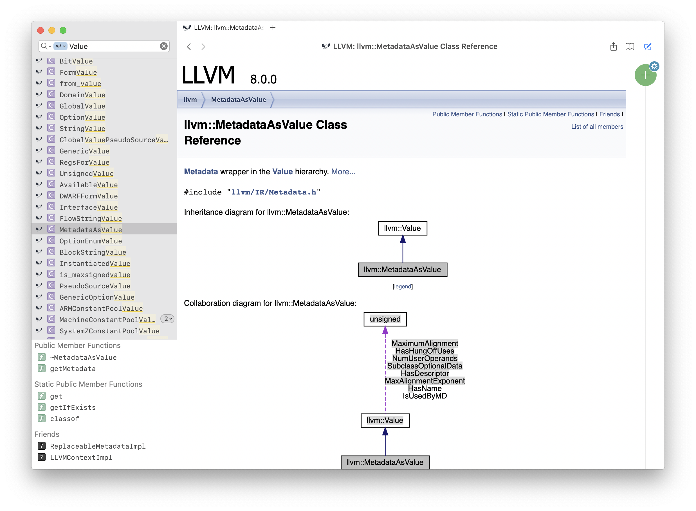

# generate-llvm-docset

A Python 3 script for generating [Dash](https://kapeli.com/dash) docset for LLVM API.



### Usage

TL;DR:

```
$ git clone https://github.com/broadwaylamb/generate-llvm-docset.git
$ cd generate-llvm-docset
$ ./generate-llvm-docset --help

usage: generate-llvm-docset.py [-h] [--clean] [--doxygen-path DOXYGEN_PATH]
                               [--dot-path DOT_PATH]
                               [--skip-docset-generation] [-q] [-v]
                               llvm_version

positional arguments:
  llvm_version          LLVM version string (e. g. 8.0.0)

optional arguments:
  -h, --help            show this help message and exit
  --clean               Download and regenerate everything from scratch
  --doxygen-path DOXYGEN_PATH
                        The path to doxygen executable
  --dot-path DOT_PATH   The path to dot (from Graphviz) executable
  --skip-docset-generation
                        Only generate HTML documentation, without Dash .docset
                        file
  -q, --quiet           Suppress the output
```

Create a directory where the generated files will be located, and run the script from there:

```
$ mkdir build
$ ../generate-llvm-docset.py 8.0.0
Downloading llvm-8.0.0.src.tar.xz from http://releases.llvm.org/8.0.0/llvm-8.0.0.src.tar.xz...
Extracting llvm-8.0.0.src.tar.xz into llvm-8.0.0.src...
Configuring doxygen using llvm-8.0.0.src/docs/doxygen.cfg.in...
Generating HTML documentation (this may take some time)...
Running /usr/local/bin/doxygen doxygen.cfg
Creating LLVM.docset (this may take some time)...
Running ../DocSetUtil/Developer/usr/bin/docsetutil index LLVM.docset
Progress: |████████████████████████████████| 100.00%
Adding the nice dragon icon...
Patching Info.plist file...
Done!
```

You can specify any LLVM version you want.

### Prerequisites

- `doxygen` — can be installed via [Homebrew](http://brew.sh/): `brew install doxygen`
- `dot` — a part of Graphviz, can also be installed via Homebrew: `brew install graphviz`
